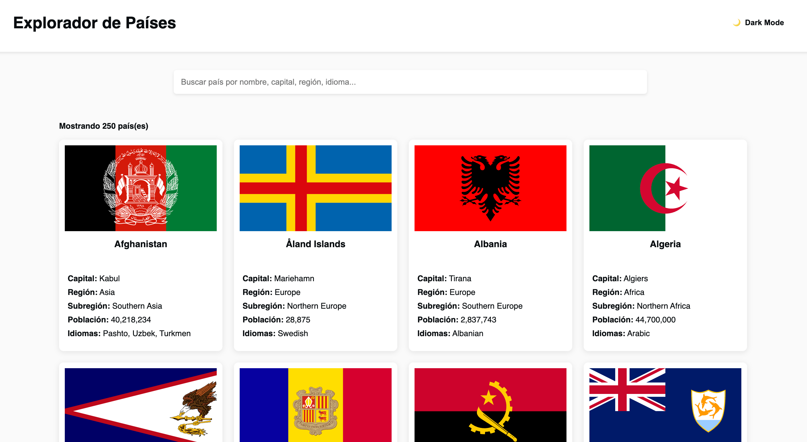

# Frontend Mentor - API REST de países con solución de cambio de tema de color

## Tabla de contenidos

- [Resumen](#resumen)
  - [El reto](#el-reto)
  - [Capturas de pantalla](#capturas-de-pantalla)
  - [Enlaces](#enlaces)
- [Mi proceso](#mi-proceso)
  - [Construido con](#construido-con)
  - [Lo que aprendí](#lo-que-aprendí)
  - [Desarrollo continuo](#desarrollo-continuo)
  - [Recursos útiles](#recursos-útiles)
- [Autor](#autor)
- [Agradecimientos](#agradecimientos)

## Resumen

### El reto

Los usuarios deberían poder:

- Ver todos los países desde la API en la página principal
- Buscar un país usando un campo de `input`
- Filtrar países por región
- Hacer clic en un país para ver información detallada en una página separada
- Hacer clic para ver los países fronterizos en la página de detalles
- Alternar el esquema de colores entre modo claro y oscuro *(opcional)*

## Guía de estilos

La guía completa de estilos y decisiones de diseño se encuentra en [style-guide.md](./style-guide.md)

### Capturas de pantalla



### Enlaces

- URL de solución: [URL GITHUB](https://github.com/jorge-maikel-sierra/countries-explorer-webapp)
- URL del sitio en directo: [URL PRODUCCION](https://jorge-maikel-sierra.github.io/countries-explorer-webapp)

## Mi proceso

### Construido con

- Semantic HTML5 markup
- CSS custom properties
- Flexbox
- CSS Grid
- Mobile-first workflow
- For styles

### Lo que aprendí

Durante este proyecto, adquirí varios conocimientos importantes que me gustaría destacar:

- **Manejo de APIs REST**: Aprendí a realizar peticiones a la API de países y manejar las respuestas.

```javascript
async function fetchData() {
  try {
    const response = await fetch("data.json");

    if (!response.ok) {
      throw new Error(`HTTP error! status: ${response.status}`);
    }

    const data = await response.json();
    allCountries = data;
    return data;
  } catch (error) {
    console.error("Error fetching data:", error);
    return [];
  }
}
```

- **Implementación del tema oscuro**: Logré implementar un sistema de cambio de tema utilizando CSS variables.

```css
:root {
    --very-dark-blue-bg: hsl(207, 26%, 17%);
    --dark-blue-elements: hsl(209, 23%, 22%);
    --very-dark-blue-text: hsl(200, 15%, 8%);
    --dark-gray-input: hsl(0, 0%, 52%);
    --very-light-gray-bg: hsl(0, 0%, 98%);
    --white: hsl(0, 0%, 100%);
}

```

- **Filtrado de datos**: Implementé un sistema de búsqueda y filtrado eficiente.

```javascript
// Función para manejar la búsqueda
function handleSearch() {
  const searchBar = document.getElementById("searchBar");
  if (!searchBar) {
    console.error("Elemento searchBar no encontrado");
    return;
  }

  const searchTerm = searchBar.value.toLowerCase().trim();

  // Verificar que allCountries sea un array
  if (!Array.isArray(allCountries)) {
    console.error("No hay datos de países disponibles");
    return;
  }

  // Si el término de búsqueda está vacío, mostrar todos los países
  if (searchTerm === "") {
    displayData(allCountries);
    return;
  }

  const filteredCountries = allCountries.filter((country) => {
    // Verificar que country sea un objeto válido
    if (!country) return false;

    // Buscar en múltiples campos con verificaciones de existencia
    return (
      (country.name && country.name.toLowerCase().includes(searchTerm)) ||
      (country.capital && country.capital.toLowerCase().includes(searchTerm)) ||
      (country.region && country.region.toLowerCase().includes(searchTerm)) ||
      (country.subregion &&
        country.subregion.toLowerCase().includes(searchTerm)) ||
      (country.population &&
        country.population.toString().includes(searchTerm)) ||
      (country.languages &&
        Array.isArray(country.languages) &&
        country.languages.some(
          (lang) =>
            lang && lang.name && lang.name.toLowerCase().includes(searchTerm)
        ))
    );
  });

  // Mostrar los países filtrados
  displayData(filteredCountries);
}
```

### Desarrollo continuo

Quiero seguir profundizando en JavaScript, ya que es un lenguaje que aún no domino del todo. Aunque he aprendido mucho trabajando en este proyecto, siento que hay conceptos avanzados y patrones de diseño que puedo mejorar y aplicar de manera más eficiente en futuros desarrollos.

### Recursos útiles

- [W3Schools](https://www.w3schools.com/) - Una excelente fuente de recursos y tutoriales que me ayudó a reforzar conceptos de JavaScript y HTML.
- [CSS3 - MDN Web Docs](https://developer.mozilla.org/es/docs/Web/CSS) - Documentación detallada sobre CSS que fue fundamental para implementar los estilos y el tema oscuro.

## Autor

- GitHub - [@jorge-maikel-sierra](https://github.com/jorge-maikel-sierra)
- Frontend Mentor - [@jorge-maikel-sierra](https://www.frontendmentor.io/profile/jorge-maikel-sierra)
- Twitter - [@Jorge_Sierra_1](https://x.com/Jorge_Sierra_1)

## Agradecimientos

Quiero expresar mi más profundo agradecimiento a Nolger Rodriguez por su continuo apoyo y colaboración. Gracias por creer en mí, tanto como desarrollador como persona. Tu confianza y guía han sido fundamentales en mi crecimiento profesional y personal.
